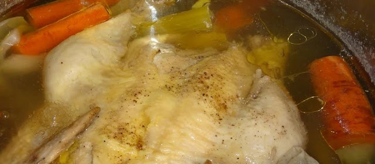

This is a really good chicken stock that can be used for a number of other dishes. It takes a while to make, but it will give really good flavour to any soup or sauce, risotto or anything you use it with.

  
  

###   

### Ingredients:

  * 1 chicken

  * 2 carrots

  * 1/2 leek

  * 1 onion

  * 2 shallots

  * 1 celery root

  * 2-3 bay leaves

  * 1 ts whole pepper grains

  * 1,5 liter water

  * 1 ts salt

###   

### Steps:

  * Partition the chicken. Chop the vegetables.

  * Put everything in a casserole and let it simmer for 2 – 2,5 hours.

