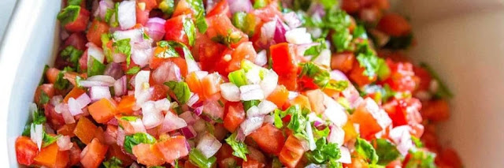

Jeg kan sjelden holde meg unna en skikkelig god salsa, og dette er en av de beste oppskriftene jeg har kommet over. Den passer til nesten alt, og holder noen dager i kjøleskapet.

### Ingredienser:

  * 5-6 store, modne, saftige tomater. Tøm den for frø og saft, og skjær opp i små biter.

  * 1/2 stor, rødløk, finhakket.

  * 1 grønn jalapeño. Fjern frø og finhakk.

  * En håndfull finhakket, fersk koriander.

  * Minst 2 fedd hvitløk, presset.

  * Saften fra 2 lime. Salt og pepper.

### Forberedelser:

Bland alle ingrediensene i en bolle. Skvis lime over, og smak til med salt. Nyt!
