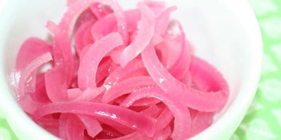

Pickled onions are a treat that can be added to many dishes to add an extra piece of flavour. They are really easy to make, and last for days and weeks in the refridgerator.

### Ingredients:

  * 2 red onions

  * 1/2 dl apple cider vinegar

  * 1 tbs cane sugar

  * 1/2 ts salt

### Steps:

Add everything but the onions to a pot. When it boils, add the sliced onions and stir. Add the lid, turn off the heat and let it stand until cold.
