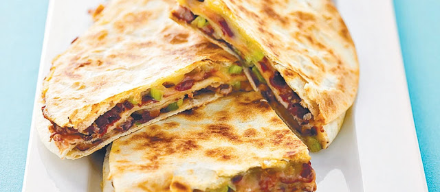

I always thought quesadillas needed some kind of meat to be interesting. That was until I tried this.

## Ingredients:

  * 1 onion, chopped

  * 1 chinese garlic, finely chopped

  * 1 red or yellow paprika, chopped

  * 2 carrots, grated

  * 1 can (400gr) black or brown beans

  * 1 ts tomato purée

  * 1 ts cumin

  * 1 ts paprika

  * 1/2 ts smoked paprika

  * 2 ts oregano

  * 1 ts sugar

  * 1 can (400gr) chopped tomatoes

  * salt and pepper

  * 8 large corn tortillas

  * 150 gr grated cheese

And for the accompanying guacamole:

  * 2 large, ripe avocadoes

  * 2 cloves of garlic

  * salt and pepper

  * 1 lime, the juice

  * 1 handful of fresh coriander

## Steps:

Start with a medium pan on medium heat, and add onions and garlic. Let them simmer until soft. Add paprika and carrots. Give them a few minutes, then add beans, tomato purée and spices. Wait a minute or two, then add the chopped tomatoes.

The bean stew can now simmer for 5-10 minutes while you prepare the guacamole.

Prepare the quesadillas by putting an even spread of bean stew on the tortilla, then cheese, then another tortilla on top. I usually cover the top tortilla with a sprinkle of olive oil, for taste, and to keep it from drying.

Bake in oven (200 degrees) until the cheese has melted, and serve immediately with guacamole, salsa and a green salad.
