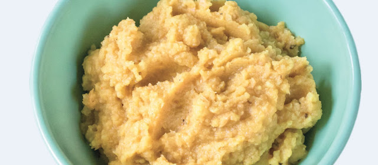

This is a really tasty version of hummus. I originally found this in an old recipe book by Jamie Oliver, and I’ve made this many many times. I’ve made a couple of small changes to the original recipe along the way, and here it is: 

### 

  

### 

Ingredients:

  * 400 gr chickpeas

  * 1/2 ts cumin

  * 1 clove garlic

  * 1 small dried chili

  * The juice from 1 lemon

  * Olive oil

  * Salt and pepper

  * 1 cm fresh turmeric

### 

  

### 

Steps:

Rinse the chickpeas, and put them in a food processor or blender container along with the rest of the ingredients. Blend until smooth. Make sure there are no large chili or turmeric pieces floating around.

Use as spreading on a piece of bread, or any other way you would use hummus.

